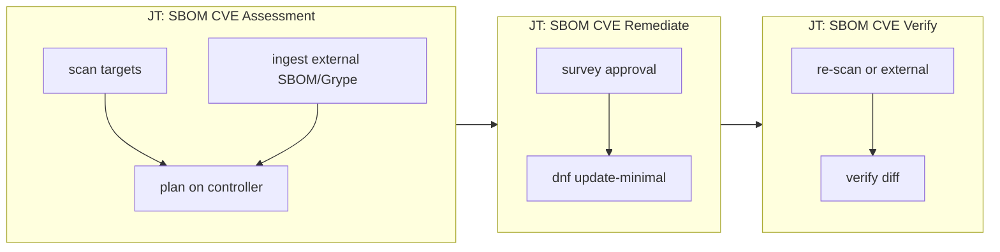

# Ansible Automation Platform integration

Prepare `secops.sbom` for AAP job templates, workflow orchestration, and external SBOM ingestion.

## Architecture



| Job template | Playbook | Hosts | Purpose |
|--------------|----------|-------|---------|
| **SBOM CVE Assessment** | `playbooks/aap_assessment.yml` | targets + localhost | Scan OR ingest external SBOM → `remediation-plan.json` |
| **SBOM CVE Remediate** | `playbooks/aap_remediate.yml` | `rhel_hosts` | Apply plan (survey approval required) |
| **SBOM CVE Verify** | `playbooks/aap_verify.yml` | targets + localhost | Re-scan and diff CVE counts |

Artifacts persist under **`/runner/project/artifacts/<hostname>/`** across JT runs in the same project.

## Execution environment

Build from `aap/execution-environment/execution-environment.yml`:

```bash
cd aap/execution-environment
ansible-builder build -f execution-environment.yml -t secops-sbom-ee:latest -v3
```

Includes Syft, Grype (pinned), Python 3, rsync (dedicated scan node DB sync).

Vendor `secops.sbom` into the EE build context (`_build/collections/`) before building.

## Controller project layout

```
/runner/project/
├── ansible_collections/secops/sbom/
├── artifacts/                    # SBOM_ARTIFACT_ROOT (created at runtime)
├── external/                     # optional: CI-dropped SBOM files
└── inventory/
```

Set **`SBOM_ARTIFACT_ROOT=/runner/project/artifacts`** on job templates (default in `inventory/group_vars/aap.yml`).

## Job template configuration

### Assessment JT

| Setting | Value |
|---------|-------|
| Playbook | `ansible_collections/secops/sbom/playbooks/aap_assessment.yml` |
| Inventory | RHEL hosts + localhost |
| EE | `secops-sbom-ee` |
| Survey | `aap/surveys/assessment.json` |
| Extra vars | `aap/extra_vars/job_templates.yml` |
| Limit | target hosts (scan mode) |

**Input modes** (survey `sbom_input_mode`):

| Mode | Behavior |
|------|----------|
| `scan` | Syft + Grype on targets (default) |
| `external_sbom` | Copy SBOM from controller path → Grype on execution node → plan |
| `external_grype` | Copy Grype JSON → plan (skip Grype) |

External mode requires **`sbom_artifact_host`** matching inventory hostname used for remediation `--limit`.

### Remediate JT

| Setting | Value |
|---------|-------|
| Playbook | `ansible_collections/secops/sbom/playbooks/aap_remediate.yml` |
| Survey | `aap/surveys/remediate.json` |
| Limit | hosts with `remediation-plan.json` |
| Tags | optional selective `advisory-RHSA-*` / `cve-CVE-*` |

Survey must set **`remediation_approved=true`** after plan review.

### Verify JT

Same inventory/limit as assessment. Re-scans targets or re-ingests external SBOM, writes `verify-diff.json`.

## Workflow job template (recommended)

```
[Assessment JT] → [Manual approval node] → [Remediate JT] → [Verify JT]
```

Pass `sbom_plan_hosts` or use `--limit` consistently across nodes. Share project artifacts directory.

## External SBOM examples

### Syft JSON from CI

```yaml
sbom_input_mode: external_sbom
sbom_artifact_host: rhel1
sbom_external_syft_path: /runner/project/external/rhel1.syft.json
sbom_target_os_distro: "9.4"
sbom_grype_distro: redhat:9.4
```

### Pre-generated Grype report

```yaml
sbom_input_mode: external_grype
sbom_artifact_host: rhel1
sbom_external_grype_path: /runner/project/external/rhel1-grype.json
```

Standalone CLI equivalent:

```bash
ansible-playbook ansible_collections/secops/sbom/playbooks/ingest_external.yml \
  -e sbom_input_mode=external_sbom \
  -e sbom_artifact_host=rhel1 \
  -e sbom_external_syft_path=/path/to/sbom.syft.json \
  -e sbom_target_os_distro=9.4
```

Then remediate:

```bash
ansible-playbook ansible_collections/secops/sbom/playbooks/remediate.yml \
  -l rhel1 \
  -e remediation_require_approval=false
```

## Local development vs AAP

| Variable | Local (`group_vars/all.yml`) | AAP (`group_vars/aap.yml`) |
|----------|------------------------------|----------------------------|
| `sbom_controller_artifact_root` | `playbook_dir/../../../../artifacts` | `/runner/project/artifacts` |
| `remediation_require_approval` | `false` | `true` |

Merge `inventory/group_vars/aap.yml` into AAP inventory for controller jobs.
