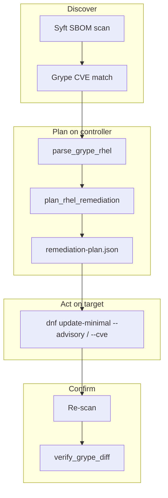
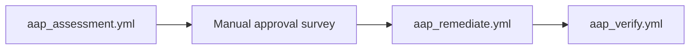

# SBOM-as-Code Project Overview

Ansible collection **`secops.sbom`** (v0.2.0) that closes the loop from SBOM-derived CVE findings to targeted RHEL security updates. For day-to-day commands and architecture details, see [CLAUDE.md](../CLAUDE.md) and the [collection README](../ansible_collections/secops/sbom/README.md).

## What problem it solves

Most supply-chain tooling stops at **finding** CVEs in a Software Bill of Materials (SBOM). This project closes the loop: it scans RHEL hosts (or ingests external SBOMs), matches vulnerabilities with **Grype**, builds a **remediation plan** on the Ansible controller, and applies **targeted** fixes via `dnf update-minimal` — by RHSA advisory when possible, by CVE as fallback.

It is intentionally **not** configuration hardening (that is ComplianceAsCode / OpenSCAP territory). It is **OS CVE patching driven by SBOM inventory**.



## Core components

| Layer | Location | Role |
|-------|----------|------|
| **Collection** | [`ansible_collections/secops/sbom/`](../ansible_collections/secops/sbom/) | Ansible Galaxy collection `secops.sbom` |
| **Playbooks** | [`playbooks/`](../ansible_collections/secops/sbom/playbooks/) | `scan`, `plan_remediation`, `remediate`, `verify`, plus `ingest_external` and AAP wrappers |
| **Roles** | [`roles/`](../ansible_collections/secops/sbom/roles/) | Install scanners, run Syft/Grype, ingest external files, plan, apply, verify |
| **Custom modules** | [`plugins/modules/`](../ansible_collections/secops/sbom/plugins/modules/) | Python logic for parsing Grype output, building plans, diffing before/after |
| **Policy** | [`policy/remediation.yml`](../ansible_collections/secops/sbom/policy/remediation.yml) | Severity threshold (default High+), approval gates, artifact paths |
| **AAP assets** | [`aap/`](../aap/) | Execution environment, job template surveys, workflow guidance |
| **Dev inventory** | [`inventory/`](../inventory/) | Local hosts + group vars; separate [`group_vars/aap.yml`](../inventory/group_vars/aap.yml) for controller runs |

## The four-stage pipeline

### 1. Scan (`scan.yml`)

Runs on RHEL targets in inventory (`rhel_hosts`):

- Installs **Syft** and **Grype** (via `scanners` role)
- Syft generates SBOM (Syft JSON + CycloneDX)
- Grype matches CVEs against Red Hat errata
- Artifacts are fetched to the controller under `artifacts/<hostname>/`
- Saves baseline `grype-report.before.json`

**Scan scopes** control speed vs depth ([`sbom_scan_scope`](../inventory/group_vars/all.yml)):

| Scope | Description |
|-------|-------------|
| **minimal** (default) | RPM DB only — fastest path for CVE remediation |
| **medium** | RPM + kernel modules |
| **full** | All filesystem catalogers — supply-chain depth |

### 2. Plan (`plan_remediation.yml`)

Runs on **localhost / execution node only** — targets are not contacted:

- Reads slim Grype JSON from artifacts
- Applies policy ([`min_severity: high`](../ansible_collections/secops/sbom/policy/remediation.yml), actionable-only)
- Produces `remediation-plan.json` (RHSA-first, CVE fallback) and `findings-preview.json`

### 3. Remediate (`remediate.yml`)

Runs on the **same inventory hostname** as the scan:

- `dnf update-minimal --advisory RHSA-…` (preferred)
- `dnf update-minimal --cve CVE-…` when no advisory mapping exists
- **Not** a broad `dnf update` — only planned security fixes

**Safety gate:** by default `remediation_require_approval: true`; remediate aborts unless `remediation_approved=true` (AAP survey enforces this).

### 4. Verify (`verify.yml`)

- Re-scans target, compares Grype reports via `verify_grype_diff`
- Writes `verify-diff.json` and `grype-report.post.json`

## Three input modes

Not every SBOM originates on the host. Set [`sbom_input_mode`](../CLAUDE.md) to one of:

| Mode | Syft | Grype | Use case |
|------|------|-------|----------|
| `scan` | on target | on target | Default — live inventory |
| `external_sbom` | skip | on controller | CI/CD, vendor, or registry SBOM dropped on controller |
| `external_grype` | skip | skip | Pre-built Grype JSON only — straight to planning |

External flow uses [`ingest_external.yml`](../ansible_collections/secops/sbom/playbooks/ingest_external.yml) and the `external_sbom` role. **`sbom_artifact_host`** must match the inventory name used later for `remediate.yml --limit`.

Example: [`examples/external-sbom/ingest-external.example.yml`](../examples/external-sbom/ingest-external.example.yml)

## Ansible Automation Platform (AAP)

The repo is structured for AAP job templates, not just ad-hoc CLI:



- [`aap/README.md`](../aap/README.md) — JT setup, EE build, workflow wiring
- [`aap/execution-environment/`](../aap/execution-environment/) — EE with Syft, Grype, collection
- Surveys in [`aap/surveys/`](../aap/surveys/) — assessment params and remediate approval

Artifacts on AAP use `SBOM_ARTIFACT_ROOT=/runner/project/artifacts` (see [`inventory/group_vars/aap.yml`](../inventory/group_vars/aap.yml)).

## Optional: dedicated scan node

[`sbom_scan_node`](../CLAUDE.md) centralizes Grype DB updates and orchestration. Syft/Grype still execute **on each target** (they need local RPM DB access). Useful when you want one node to manage scanner versions and DB freshness across many hosts.

Example: [`examples/inventory/scan-node.yml`](../examples/inventory/scan-node.yml)

## Artifacts (what gets produced)

All under `artifacts/<hostname>/` (gitignored):

```
sbom.syft.json, sbom.cyclonedx.json
grype-report.json          # slim ~250 KB (not ~270 MB raw)
grype-report.before.json
remediation-plan.json
findings-preview.json
scan-metadata.json         # timings, scope, input mode
verify-diff.json           # after verify
```

Performance work in v0.2.0: explicit Syft cataloger exclusions, Grype `--distro redhat:<version>`, slim JSON via `slim_grype_report.py`, no Ansible `slurp` of huge files.

## How it fits in the broader ecosystem

| Project | Focus |
|---------|-------|
| **sbom-as-code (this repo)** | SBOM → Grype → **patch RHEL CVEs** |
| **ComplianceAsCode / scap-security-guide** | STIG/CIS **configuration** hardening |
| **Existing supply-chain profile** | Syft + Grype → findings ingest — **no OS remediation yet** |

Future intent: integrate as `profiles/sbom-rhel-cve/` inside `aap-compliance-pipelines`.

## Current state and known gaps

**Working today:**

- Full/minimal/medium scan scopes on live hosts
- Controller-side planning from scan or external Grype
- AAP playbooks, EE definition, surveys
- Unit tests in [`tests/unit/test_grype_rhel.py`](../ansible_collections/secops/sbom/tests/unit/test_grype_rhel.py)

**Blocked / incomplete:**

- Live **remediate + verify** requires working RHEL subscription/repos on targets
- `remediation_enforce` policy key not fully wired
- Selective remediation tags need refactor (`include_tasks` instead of dynamic `tags:`)
- Phase 5: merge into `aap-compliance-pipelines`

## Quick mental model

Think of it as **"patch what the SBOM says is vulnerable"** with guardrails:

1. **Discover** what's installed and what's vulnerable (Syft + Grype)
2. **Plan** on the controller with policy filters (High+, RHSA-first)
3. **Patch** minimally on the host (`dnf update-minimal`, human approval optional)
4. **Prove** the CVE count dropped (re-scan + diff)

Run locally from repo root:

```bash
export ANSIBLE_COLLECTIONS_PATH="$(pwd)/ansible_collections"
ansible-playbook ansible_collections/secops/sbom/playbooks/scan.yml -l rhel1
ansible-playbook ansible_collections/secops/sbom/playbooks/plan_remediation.yml \
  -e '{"sbom_plan_hosts":["rhel1"]}'
```
